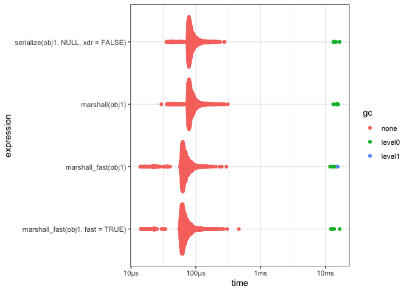
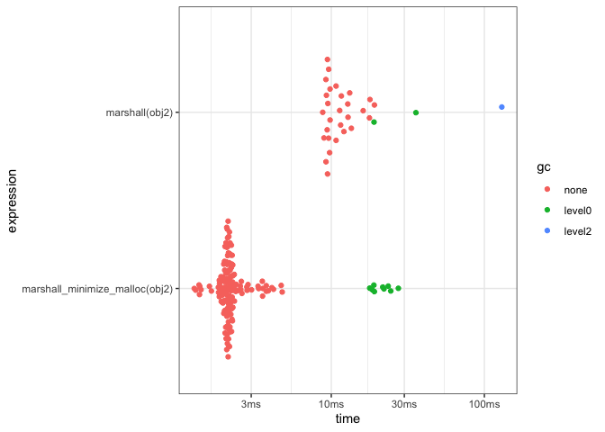
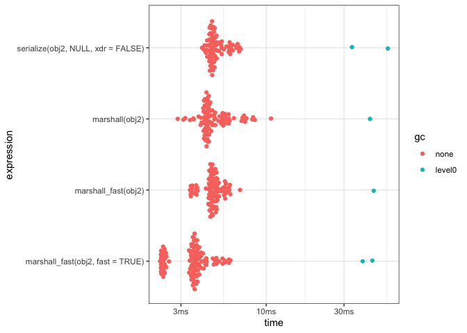

<!-- README.md is generated from README.Rmd. Please edit that file -->

# serializer

<!-- badges: start -->


[](https://github.com/coolbutuseless/serializer/actions)
<!-- badges: end -->

`serializer` is a package which demonstrates how to use R’s internal
serialization interface from C. The code is the minimum amount of code
required to do this, and I’ve inserted plenty of comments for guidance.

This package was developed to help me figure out the serialization
process in R. It is perhaps only really interesting if you want to look
at and/or steal the C code. It’s under the [MIT
license](https://mit-license.org/), so please feel free to re-use in
your own projects.

If you want a rock solid version of this package that already exists,
use
[RApiSerialize](https://cran.r-project.org/web/packages/RApiSerialize/index.html).

## What’s in the box

-   `marshall()`/`unmarshall()` are direct analogues for
    `base::serialize()` and `base::unserialize()`
-   `calc_size()` calculates the exact size of the serialized
    representation of an object using R’s seriazliation infrastructure
    but not actually allocating any bytes.
-   `marshall_fast()` is a modified version of `marshall()` which
    minimises memory allocations by pre-calculating the final size of
    the serialized representation. It speeds up the serialization
    process for larger objects.

## Installation

You can install from
[GitHub](https://github.com/coolbutuseless/serializer) with:

``` r
# install.package('remotes')
remotes::install_github('coolbutuseless/serializer')
```

## Notes

-   Using R’s serialization infrastructure from C involves 2 main parts:
    -   a buffer (which could be memory, a file, a pipe, etc) with
        accompanying functions for reading and writing bytes to/from the
        buffer
    -   input/output stream wrappers around this buffer initialised and
        created using R internals
        -   Input stream: `R_inpstream_st`, `R_InitInPStream()`
        -   Output stream: `R_outpstream_st`, `R_InitOutPStream()`

## Example

``` r
library(serializer)

#~~~~~~~~~~~~~~~~~~~~~~~~~~~~~~~~~~~~~~~~~~~~~~~~~~~~~~~~~~~~~~~~~~~~~~~~~~~~~
# The object to be serialized
#~~~~~~~~~~~~~~~~~~~~~~~~~~~~~~~~~~~~~~~~~~~~~~~~~~~~~~~~~~~~~~~~~~~~~~~~~~~~~
dat <- head(mtcars, 3)

#~~~~~~~~~~~~~~~~~~~~~~~~~~~~~~~~~~~~~~~~~~~~~~~~~~~~~~~~~~~~~~~~~~~~~~~~~~~~~
# Calculate exactly how many bytes this will take once serialized
#~~~~~~~~~~~~~~~~~~~~~~~~~~~~~~~~~~~~~~~~~~~~~~~~~~~~~~~~~~~~~~~~~~~~~~~~~~~~~
serializer::calc_size(dat)
#> [1] 674

#~~~~~~~~~~~~~~~~~~~~~~~~~~~~~~~~~~~~~~~~~~~~~~~~~~~~~~~~~~~~~~~~~~~~~~~~~~~~~
# Serialized results from this package and base::serialize should be identical
#~~~~~~~~~~~~~~~~~~~~~~~~~~~~~~~~~~~~~~~~~~~~~~~~~~~~~~~~~~~~~~~~~~~~~~~~~~~~~
v1 <- serializer::marshall(head(dat))
v2 <- base::serialize(dat, NULL, xdr = FALSE)
identical(v1, v2)
#> [1] TRUE

#~~~~~~~~~~~~~~~~~~~~~~~~~~~~~~~~~~~~~~~~~~~~~~~~~~~~~~~~~~~~~~~~~~~~~~~~~~~~~
# The serialized length should match the calculation from earlier
#~~~~~~~~~~~~~~~~~~~~~~~~~~~~~~~~~~~~~~~~~~~~~~~~~~~~~~~~~~~~~~~~~~~~~~~~~~~~~
length(v1)
#> [1] 674
head(v1, 200)
#>   [1] 42 0a 03 00 00 00 01 01 04 00 00 05 03 00 05 00 00 00 55 54 46 2d 38 13 03
#>  [26] 00 00 0b 00 00 00 0e 00 00 00 03 00 00 00 00 00 00 00 00 00 35 40 00 00 00
#>  [51] 00 00 00 35 40 cd cc cc cc cc cc 36 40 0e 00 00 00 03 00 00 00 00 00 00 00
#>  [76] 00 00 18 40 00 00 00 00 00 00 18 40 00 00 00 00 00 00 10 40 0e 00 00 00 03
#> [101] 00 00 00 00 00 00 00 00 00 64 40 00 00 00 00 00 00 64 40 00 00 00 00 00 00
#> [126] 5b 40 0e 00 00 00 03 00 00 00 00 00 00 00 00 80 5b 40 00 00 00 00 00 80 5b
#> [151] 40 00 00 00 00 00 40 57 40 0e 00 00 00 03 00 00 00 33 33 33 33 33 33 0f 40
#> [176] 33 33 33 33 33 33 0f 40 cd cc cc cc cc cc 0e 40 0e 00 00 00 03 00 00 00 f6

#~~~~~~~~~~~~~~~~~~~~~~~~~~~~~~~~~~~~~~~~~~~~~~~~~~~~~~~~~~~~~~~~~~~~~~~~~~~~~
# Unmarshall the raw bytes back into an object  
#~~~~~~~~~~~~~~~~~~~~~~~~~~~~~~~~~~~~~~~~~~~~~~~~~~~~~~~~~~~~~~~~~~~~~~~~~~~~~
serializer::unmarshall(v1)
#>                mpg cyl disp  hp drat    wt  qsec vs am gear carb
#> Mazda RX4     21.0   6  160 110 3.90 2.620 16.46  0  1    4    4
#> Mazda RX4 Wag 21.0   6  160 110 3.90 2.875 17.02  0  1    4    4
#> Datsun 710    22.8   4  108  93 3.85 2.320 18.61  1  1    4    1
```

## What’s the upper bound on serialization speed?

`calc_size()` can be used to calculate the size of a serialized object,
but does not actually try and create the serialized object.

Because this does not do any memory allocation, or copying of bytes, the
speed of `calc_size()` should give an approximation of the maximum
throughput of the serialization process when using R’s internal
serialization mechanism.

The speeds below seem ridiculous, because at its core, serialization is
just passing *pointers* + *lengths* to an output stream, and doing very
very little actual memory allocation or copying.

``` r
#~~~~~~~~~~~~~~~~~~~~~~~~~~~~~~~~~~~~~~~~~~~~~~~~~~~~~~~~~~~~~~~~~~~~~~~~~~~~~
# Test objects
#~~~~~~~~~~~~~~~~~~~~~~~~~~~~~~~~~~~~~~~~~~~~~~~~~~~~~~~~~~~~~~~~~~~~~~~~~~~~~
N <- 1e7
obj1 <- data.frame(x = sample(N), y = runif(N))
obj2 <- do.call(rbind, replicate(1000, iris, simplify = FALSE))
obj3 <- sample(N)
obj4 <- sample(10)

#~~~~~~~~~~~~~~~~~~~~~~~~~~~~~~~~~~~~~~~~~~~~~~~~~~~~~~~~~~~~~~~~~~~~~~~~~~~~~
# Calc sizes of test objects
#~~~~~~~~~~~~~~~~~~~~~~~~~~~~~~~~~~~~~~~~~~~~~~~~~~~~~~~~~~~~~~~~~~~~~~~~~~~~~
(n1 <- lobstr::obj_size(obj1))
#> 120,000,848 B
(n2 <- lobstr::obj_size(obj2))
#> 5,401,800 B
(n3 <- lobstr::obj_size(obj3))
#> 40,000,048 B
(n4 <- lobstr::obj_size(obj4))
#> 96 B

#~~~~~~~~~~~~~~~~~~~~~~~~~~~~~~~~~~~~~~~~~~~~~~~~~~~~~~~~~~~~~~~~~~~~~~~~~~~~~
# go through seritalization process, but only count the bytes
#~~~~~~~~~~~~~~~~~~~~~~~~~~~~~~~~~~~~~~~~~~~~~~~~~~~~~~~~~~~~~~~~~~~~~~~~~~~~~
res <- bench::mark(
  calc_size(obj1),
  calc_size(obj2),
  calc_size(obj3),
  calc_size(obj4),
  check = FALSE
)


#~~~~~~~~~~~~~~~~~~~~~~~~~~~~~~~~~~~~~~~~~~~~~~~~~~~~~~~~~~~~~~~~~~~~~~~~~~~~~
# calc theoretical upper limit
#~~~~~~~~~~~~~~~~~~~~~~~~~~~~~~~~~~~~~~~~~~~~~~~~~~~~~~~~~~~~~~~~~~~~~~~~~~~~~
res %>% 
  mutate(MB = round(c(n1, n2, n3, n4)/1024^2)) %>%
  mutate(`GB/s` = round(MB/1024 / as.numeric(median), 1)) %>%
  mutate(`itr/sec` = round(`itr/sec`)) %>%
  select(expression, median, `itr/sec`, MB, `GB/s`) %>%
  knitr::kable(caption = "Maximum possible throughput of serialization")
```

| expression       |  median | itr/sec |  MB |   GB/s |
|:-----------------|--------:|--------:|----:|-------:|
| calc\_size(obj1) | 13.16µs |   68457 | 114 | 8460.9 |
| calc\_size(obj2) |  7.55µs |  109609 |   5 |  646.4 |
| calc\_size(obj3) |  8.11µs |  106508 |  38 | 4575.8 |
| calc\_size(obj4) |  3.16µs |  208325 |   0 |    0.0 |

Maximum possible throughput of serialization

## Minimising memory allocations can increase serialization speed

`marshall_fast()` pre-calculates the size of the serialized data, and
performs only **1** memory allocation (exclusing whatever R is doing
internally).

For small objects, the pre-calculation of size increases overall
serialization time, but for medium-to-large objects it is often a win.

#### data.frame with 1e4 rows

``` r
#~~~~~~~~~~~~~~~~~~~~~~~~~~~~~~~~~~~~~~~~~~~~~~~~~~~~~~~~~~~~~~~~~~~~~~~~~~~~~
# data.frame with 1e4 rows
#~~~~~~~~~~~~~~~~~~~~~~~~~~~~~~~~~~~~~~~~~~~~~~~~~~~~~~~~~~~~~~~~~~~~~~~~~~~~~
N <- 1e4; obj1 <- data.frame(x = sample(N), y = runif(N))

res <- bench::mark(
  serialize(obj1, NULL, xdr = FALSE),
  marshall(obj1),
  marshall_fast(obj1),
  check = TRUE
)

res %>%
  select(expression, median, `itr/sec`) %>%
  knitr::kable()
```

| expression                         |  median |   itr/sec |
|:-----------------------------------|--------:|----------:|
| serialize(obj1, NULL, xdr = FALSE) | 101.4µs |  7954.528 |
| marshall(obj1)                     |  97.9µs |  8668.037 |
| marshall\_fast(obj1)               |  78.6µs | 10969.937 |

``` r
plot(res) + theme_bw()
```



#### data.frame with 1e6 rows

``` r
#~~~~~~~~~~~~~~~~~~~~~~~~~~~~~~~~~~~~~~~~~~~~~~~~~~~~~~~~~~~~~~~~~~~~~~~~~~~~~
# data.frame with 1e6 rows
#~~~~~~~~~~~~~~~~~~~~~~~~~~~~~~~~~~~~~~~~~~~~~~~~~~~~~~~~~~~~~~~~~~~~~~~~~~~~~
N <- 1e6; obj2 <- data.frame(x = sample(N), y = runif(N))

res <- bench::mark(
  serialize(obj2, NULL, xdr = FALSE),
  marshall(obj2),
  marshall_fast(obj2),
  check = TRUE
)

res %>%
  select(expression, median, `itr/sec`) %>%
  knitr::kable()
```

| expression                         |  median |   itr/sec |
|:-----------------------------------|--------:|----------:|
| serialize(obj2, NULL, xdr = FALSE) | 27.32ms |  38.28919 |
| marshall(obj2)                     | 19.25ms |  50.72448 |
| marshall\_fast(obj2)               |  2.45ms | 251.84064 |

``` r
plot(res) + theme_bw()
```



#### data.frame with 1e6 rows

``` r
#~~~~~~~~~~~~~~~~~~~~~~~~~~~~~~~~~~~~~~~~~~~~~~~~~~~~~~~~~~~~~~~~~~~~~~~~~~~~~
# data.frame with 32000 rows
#~~~~~~~~~~~~~~~~~~~~~~~~~~~~~~~~~~~~~~~~~~~~~~~~~~~~~~~~~~~~~~~~~~~~~~~~~~~~~
obj2 <- do.call(rbind, replicate(1000, mtcars, simplify = FALSE))

res <- bench::mark(
  serialize(obj2, NULL, xdr = FALSE),
  marshall(obj2),
  marshall_fast(obj2),
  check = TRUE
)

res %>%
  select(expression, median, `itr/sec`) %>%
  knitr::kable()
```

| expression                         | median |  itr/sec |
|:-----------------------------------|-------:|---------:|
| serialize(obj2, NULL, xdr = FALSE) |  5.1ms | 174.9605 |
| marshall(obj2)                     | 4.81ms | 184.8033 |
| marshall\_fast(obj2)               |  5.8ms | 162.8915 |

``` r
plot(res) + theme_bw()
```



## Related Software

-   [RApiSerialize](https://cran.r-project.org/web/packages/RApiSerialize/index.html)
-   [qs](https://cran.r-project.org/web/packages/qs/index.html)
-   [fst](https://cran.r-project.org/web/packages/fst/index.html)

## Acknowledgements

-   R Core for developing and maintaining the language.
-   CRAN maintainers, for patiently shepherding packages onto CRAN and
    maintaining the repository
